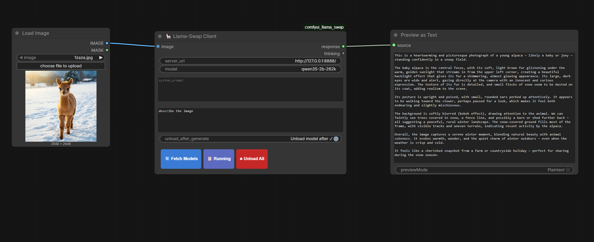

# 🦙 ComfyUI Llama-Swap Client

> A native ComfyUI node for **[llama-swap](https://github.com/mostlygeek/llama-swap)** — hot-swap any llama.cpp model without leaving your workflow.



---

## ✨ Features

| | |
|---|---|
| 🔄 **Live model picker** | Fetches `/v1/models` from your running server and shows a floating dropdown — click to set |
| 🖼️ **Multi-image vision** | Up to 4 images in a single message — reference as "image 1", "image 2", etc. in your prompt |
| 🎛️ **Full generation control** | Temperature, top_k, top_p, min_p, max_tokens, penalties, seed — each with enable toggle |
| 🧠 **Thinking extraction** | `<think>` / `<thinking>` blocks are **stripped** from `response` and surfaced in a separate `thinking` output |
| ⏏️ **Auto-unload toggle** | Calls `/unload` automatically after every generation — great for VRAM-constrained setups |
| 📋 **Running button** | Shows which model is currently warm in GPU memory via a toast notification |
| 🔴 **Unload All button** | Manually frees VRAM from inside ComfyUI without touching the terminal |

---

## 🗂️ Nodes

### 🦙 Llama-Swap Client
The main inference node.

| Input | Type | Default | Description |
|---|---|---|---|
| `server_url` | STRING | `http://localhost:8080` | llama-swap base URL |
| `model` | STRING | — | Model name — populated via **🔄 Fetch Models** |
| `system_prompt` | STRING (multiline) | — | System role message |
| `prompt` | STRING (multiline) | — | User message / question |
| `unload_after_generate` | BOOLEAN | `False` | Auto-call `/unload` after every run |
| `image_1` – `image_4` *(optional)* | IMAGE | — | Vision inputs — all provided images sent in single message |

| Output | Description |
|---|---|
| `response` | Clean human-readable text — **`<think>` blocks removed** |
| `thinking` | Extracted reasoning chain (empty string if the model produced none) |

### Generation Parameters (Optional)

Each parameter has an **enable toggle** (`use_*`). Only enabled parameters are sent to the server.

| Parameter | Type | Range | Default | Description |
|---|---|---|---|---|
| `temperature` | FLOAT | 0.0 – 2.0 | 0.8 | Controls randomness (0=deterministic, higher=creative) |
| `top_k` | INT | 0 – 100 | 40 | Sample from top K tokens (0=disabled) |
| `top_p` | FLOAT | 0.0 – 1.0 | 0.9 | Nucleus sampling threshold (1.0=disabled) |
| `min_p` | FLOAT | 0.0 – 1.0 | 0.0 | Minimum token probability (0.0=disabled) |
| `max_tokens` | INT | 0 – 100000 | 0 | Maximum response tokens (0=unlimited) |
| `frequency_penalty` | FLOAT | -2.0 – 2.0 | 0.0 | Reduce repetition |
| `presence_penalty` | FLOAT | -2.0 – 2.0 | 0.0 | Encourage new topics |
| `seed` | INT | -1 – ∞ | -1 | Random seed for reproducibility (-1=random) |

---

### 🦙 Llama-Swap Model Selector
A standalone picker that outputs `model_name` as a STRING.  
Useful to share the same model choice across multiple inference nodes.

---

## ⚡ Installation

```bash
cd ComfyUI/custom_nodes
git clone https://github.com/yourname/comfyui_llama_swap
```

> **Dependencies:** `requests` and `pillow` — both already present in any standard ComfyUI environment.

Restart ComfyUI after cloning.

---

## 🚀 Quick Start

1. Add a **🦙 Llama-Swap Client** node
2. Set `server_url` to your llama-swap address
3. Click **🔄 Fetch Models** → select a model from the dropdown
4. Connect a **Preview Text** node to `response`
5. *(Optional)* Connect a second **Preview Text** node to `thinking` to debug reasoning chains
6. Hit **Run** 🎉

---

## 📖 Usage Examples

### Multi-Image Comparison

```
image_1: [connect image node A]
image_2: [connect image node B]
prompt: "Compare image 1 and image 2. What are the main differences?"
```

### Creative Writing with Custom Parameters

```
use_temperature: ✓ enabled
temperature: 1.2
use_top_p: ✓ enabled  
top_p: 0.95
prompt: "Write a short story about..."
```

### Deterministic Code Generation

```
use_seed: ✓ enabled
seed: 42
use_temperature: ✓ enabled
temperature: 0.1
prompt: "Generate Python code for..."
```

### Using Server Defaults

Leave all `use_*` toggles disabled to let the server use its default parameters.

---

## 🧠 Thinking Output

Models like **DeepSeek-R1**, **QwQ**, **Qwen3** and other reasoning models wrap their chain-of-thought in `<think>` tags.  
This node automatically separates them:

```
response  →  clean answer, ready to use downstream
thinking  →  full reasoning trace for inspection / debugging
```

Both `<think>` and `<thinking>` variants are handled.

---

## 🔌 Backend Routes

Three lightweight proxy routes are registered on ComfyUI's `PromptServer` at startup to avoid CORS issues:

| Route | Proxies to |
|---|---|
| `GET /llama_swap/models` | `GET {url}/v1/models` |
| `GET /llama_swap/running` | `GET {url}/running` |
| `GET /llama_swap/unload` | `GET {url}/unload` |

---

## 📄 License

MIT
